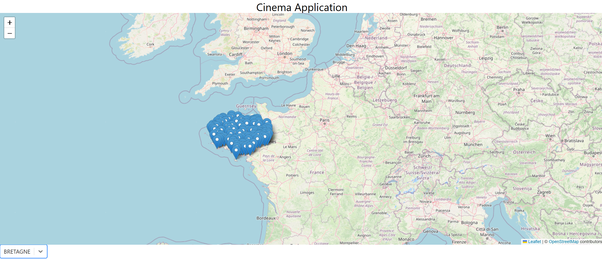
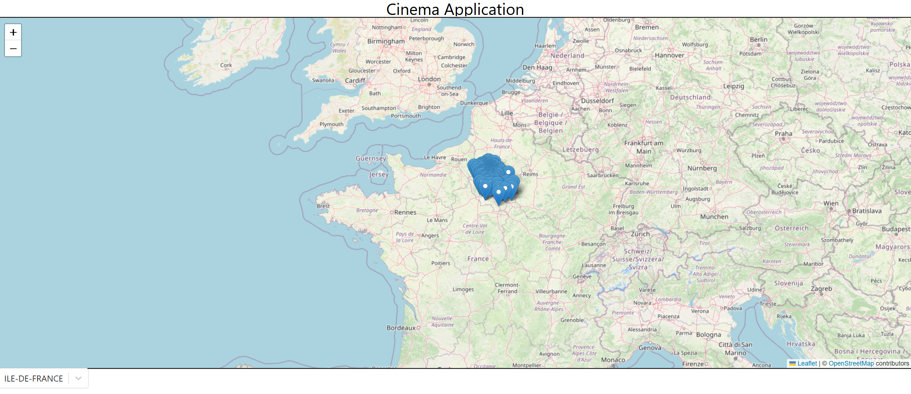

# Cinema Application

Cette application a pour but d'explorer quelques possibilités que l'on peut avoir avec les coordonnées géographiques.
Par ailleurs, ce projet me permet d'utiliser des technologies telles que React, Tailwind pour la partie front. Et PostgreSQL, Spring boot
pour la partie back.

Pour les données utilisés --> [Data](Data/README.md)

## Fonctionnalités

### Affichage des cinémas en fonction de leur région

Bretagne:

Ile de france:

### Affichage des informations d'un cinéma

### ... (en cours)

## Installtion npm

- npm create vite@latest
- npm install tailwindcss @tailwindcss/vite
- npm install leaflet
- npm install react-leaflet@next
- npm install axios
- npm i --save react-select

## Tuto / Aide
- **https://medium.com/@timndichu/getting-started-with-leaflet-js-and-react-rendering-a-simple-map-ef9ee0498202**
- **https://www.freecodecamp.org/news/how-to-use-axios-with-react/**
